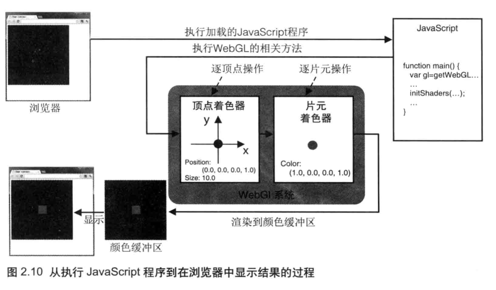
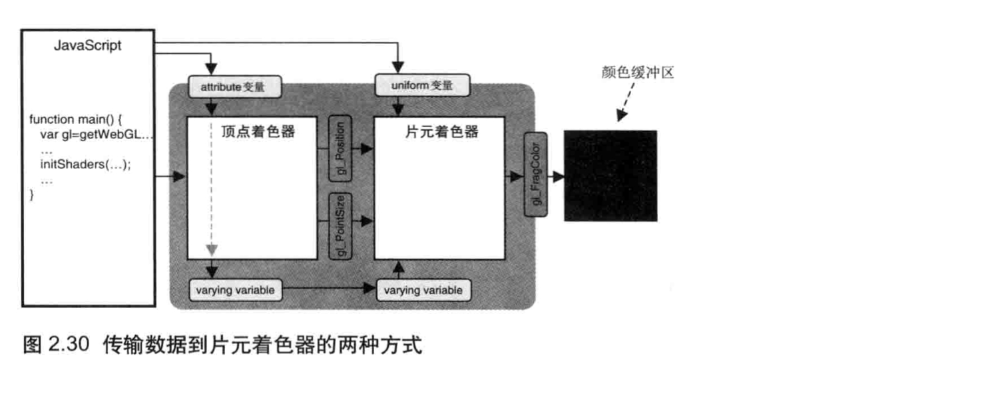

## WebGL编程指南

### 第二章 WebGL入门

#### 认识Canvas

DrawRectangle案例

```html
<body onload="main()">
  <canvas id="example" width="400" height="400">
  	Please use a browser that supports "canvas"
  </canvas>
</body>
<script src="DrawRectangle.js"></script>
```

```js
/*
主要分为三个步骤
1. 获取Canvas元素
2. 向该元素请求二维图形的 绘图上下文
3. 在绘图上下文上调用相应的绘图函数，以绘制二维图形
*/
function main() {
  var canvas = document.getElementById('example')
  if(!canvas) {
    console.log('Failed to retriveve the <canvas> element')
    return
  }
  // 获取二维图形上下文
  var ctx = canvas.getContext('2d')
  // 绘制蓝色矩形
  ctx.fillStyle = 'rgba(0,0,255,1.0)'
  ctx.fillRect(120, 10, 150, 150)
}
```

#### 认识WebGL

HelloCanvas.js

```js
function main() {
  var canvas = document.getElementById('webgl')
  // 获取上下文 工具函数 兼容写法  默认调用的方法发生错误不会打印 设置为 true 则会打印错误
  var gl = getWebGLContext(canvas, true)
  if(!gl) {
    console.log('failed to get the rendering context for webGL')
    return
  }
  // 指定 清空 canvas 的颜色
  gl.clearColor(0.0,0.0,0.0, 1.0)
  // 使用指定的元素 清空
  gl.clear(gl.COLOR_BUFFER_BIT)
}
```

清空Canvas

`gl.clear(buffer)`清空缓冲区，buffer参数 有颜色缓存区 深度缓存区 模板缓存区

+ gl.COLOR_BUFFER_BIT    指定颜色缓存
+ gl.DEPHTH_BUFFER_BIT  指定深度缓冲区
+ gl.SRENCIL_BUFFER_BIT 指定模版缓冲区

如果没有指定背景色，那么使用默认值

+ 颜色  (0.0,0.0,0.0,0.0)  gl.clearColor(red, green, blue, alpha)
+ 深度  1.0。  gl.clearDepth(depth)
+ 模版 0  gl.clearStencil(s)

#### 绘制一个点

##### 什么是着色器

**顶点着色器：**顶点着色器是用来描述顶点特性(如：位置，大小等)的程序，**顶点**是指二维或三维空间中的一个点，比如二维空间的端点 或者 三维空间的交点

**片元着色器：**片元着色器用来进行逐片元处理过程（如光照）的程序，**片元**是一个WebGL术语，你可以理解为像素

##### 着色器运行流程

JavaScript读取了着色器的相关信息， 然后存储在**WebGL 系统**中以供调用，在执行WebGL操作的时候会先**逐顶点操作**然后**逐片元操作**，然后渲染到 **颜色缓冲区中**，缓冲区中会自动的显示到浏览器中



**WebGL程序包括运行在浏览器中的JavaScript和运行在WebGL系统的着色器程序这两个部分**

着色器使用的是类C的**OpenGL ES语言进行编写的**

##### 初始化着色器

封装方法

##### 顶点着色器

**顶点着色器内置变量**

+ Vec4  gl_Position 表示顶点位置
+ float  gl_PointSize 表示点的尺寸

**vec4 类型变量**

注意必须是 四个浮点型数据 ，着色器提供了内置的函数**vec4()**帮助创建 vec4 类型的变量

```glsl
gl_Position = vec4(0.0,0.0,0.0,1.0)
```

由四个分量组成的矢量称之为**齐次坐标**

(x,y,z, w)齐次坐标，等价于三维坐标(x/w, y/w, z/w)

##### 片元着色器

片元着色器内置唯一的变量

+ vec4 gl_FragColor   指定片元颜色(RGBA 格式)

##### 绘制操作

`gl.drawArrays(mode, first, count)`可以用来绘制各种图形

+ mode   指定绘制的方式，可接收一下常量，gl.POINTS, gl.LINES, gl.LINE_STRIP, gl.LINE_LOOP...

+ first      指定从那个顶点开始绘制(整数型)
+ count   指定绘制需要用到多少个顶点(整数型)

#### 绘制一个点2

**如何在JavaScript 和 着色器之间传输数据，**有两种方式**attribute变量 和 uniform变量 **使用那个变量取决于传输的数据本身，**attrubute变量**传输的是与顶点相关的数据， 而**uniform变量**有点全局的意思

##### 使用 attribute 变量

attribute变量是一种 GLSL 变量， 被用来从外部向顶点着色器传输数据，只有顶点着色器能使用

声明变量

```glsl
// 顶点着色器中 声明一个 attribute 属性， 需要声明成全局变量
attribute vec4 a_Position;
```

获取 attribute变量的存储位置

```js
var a_Position = gl.getAttribLocation(gl.program, 'a_Position')
if(a_Position < 0) {
  console.log('failed')
  return
}
```

> ​	我们使用 initShaders() 在WebGL系统中 建立了顶点着色器，然后WebGl就会对着色器进行解析，分辨出attribute 变量， 每个变量都有一个存储地址

`gl.getAttribLocation(program, name)` 第一个参数为 **程序对象**， 我们调用 initShaders() 方法后才会得到 gl.program

向 attribute 变量赋值

```js
gl.vertexAttrib3f(a_Position, 0.0, 0.0, 0.0)
```

> gl.vertexAttrib3f() 的同族函数
>
> gl.vertexAttrib1f(location, v0)
>
> gl.vertexAttrib2f(location, v0, v1)
>
> gl.vertexAttrib3f(location, v0, v1, v2)
>
> gl.vertexAttrib4f(location, v0, v1, v2, v3)

你也可以使用这些方法的矢量版本， 比如

```js
var position = new Float32Array([1.0, 2.0, 3.0, 1.0])
gl.vertexAttrib4fv(a_Position, position)
```

##### 使用 uniform 变量 改变颜色

从外部传递变量的 attribute 变量，只能在 顶点着色器中使用，片元着色器中使用 uniform 变量

声明变量

```glsl
precision midiump float; //精度限定词
uniform vec4 u_FragColor;
```

JS中获取变量的存储地址

```js
var u_FragColor = gl.getUniformLocation(gl.program, 'u_FragColor')
```

Js向变量赋值

```js
gl.uniform4f(u_FragColor, 1.0, 0.0, 0.0, 1.0)
```

> ​	同族函数
>
> gl.uniform1f(location, v0)
>
> gl.uniform2f(location, v0, v1)
>
> gl.uniform3f(location, v0, v1, v2)
>
> gl.uniform4f(location, v0, v1, v2, v3)

变量的传递



#### 总结

这章主要是理解什么是着色器？ 然后明白顶点着色器是逐顶点操作，而片元着色器是逐片元操作的

### 第三章 绘制和变换三角形

#### 绘制多个点

**缓冲区对象：**缓冲区对象是WebGL系统中的一块内存区域，我们可以一次性的向缓冲区对象中填充大量的顶点数据， 然后将这些数据保存其中，供顶点着色器使用

##### 使用缓冲区对象

使用缓冲区对象向顶点着色器传入多个顶点的数据，需要遵循以下五个步骤

+ 创建缓冲区对象(gl.createBuffer())
+ 绑定缓冲区对象(gl.bindBuffer(target, buffer))
+ 将数据写入缓冲区对象(gl.bufferData(target, data, usage))
+ 将缓冲区对象分配给一个attribute变量(gl.vertexAttribPointer())
+ 开启 attribute 变量(gl.enableertexAttribArray())

##### 创建缓冲区对象

使用`gl.createBuffer()`方法会在 WebGL 系统内部创建出一个 **缓冲区对象**

```js
var vertexBuffer = gl.createBuffer()
```

##### 绑定缓冲区

将**缓冲区对象**绑定到WebGL系统中已经存在的 **目标上**这个目标就是表示缓冲区对象的用途

目标有：

+ gl.ARRAY_BUFFER   表示缓冲区对象中包含 顶点的数据
+ gl.ELEMENT_ARRAY_BUFFER 表示缓冲对象中包含了顶点的索引

```js
gl.bindBuffer(gl.ARRAY_BUFFER, vertexBuffer)
```

##### 向缓冲区对象中写入数据

使用`gl.bufferData(target, data, usage)`，我们只能向**目标**中写入数据，所以需要先将缓冲区绑定到目标上，才会写入到缓冲区中

参数

+ target    gl.ARRAY_BUFFER 或 gl.ELEMENT_ARRAY_BUFFER
+ Data      写入缓冲区对象的数据(类型化数组)
+ usage    表示程序程序将如何使用存储在缓冲区中的数据，该参数只是为了优化操作
  + gl.STATIC_DRAW     只会想缓冲区对象中写入一次数据， 但需要绘制很多次
  + gl.STREAM_DRAW   只会想缓冲区对象中写入一次数据，然后绘制若干次
  + gl.DYNAMIC_DRAW. 会想缓冲区对象中写入多次数据，并绘制很多次

`类型化数组`和Array数组相似， 但是不支持 push() 和 pop() 方法，支持的方法和常量

+ get(index)  或第 index 个值
+ set(index, value) 设置第几个值为 value
+ Set(array, offset). 从第 offset 个元素开始，将数组 array 中的值填充进去
+ length.    长度

```js
const vertices = new Float32Array([
  0.0, 0.5, -0.5, -0.5, 0.5, -0.5
])
gl.bufferData(gl.ARRAY_BUFFER, vertices, gl.STATIC_DRAW)
```

##### 将缓冲区对象分配给attribute变量(gl.vertexAttribPointer())

你可以通过`gl.vertexAttrib[1234]f`系列函数为 attribute 变量分配值， 但是一次只能向变量传输一个值

`gl.vertexAttribPointer()`方法可以将整个缓冲区对象 分配给 attribute 变量

`gl.vertexAttribPointer(location, size, type, normalized, stride, offset)`方法

+ location.      指定待分配的 attribute 变量的存储位置
+ size。           指定缓冲区中每个顶点的分量个数， 若size比 attribute 变量需要的分量小，则自动补全，  1-3。补的是 0，   4分量补。1
+ type。          指定数据格式
  + gl.FLOAT   浮点型。  Float32Array
  + gl.UNSIGNED_BYTE.  无符号字节。Uint8Array
  + gl.SHORT     短数型。 Int16Array
  + gl.INT。    整型。  Int32Array
  + gl.UNSIGNED_INt   无符号整型。Uint32Array
+ Normalize。  传入 true 或 false,  表示是否将非浮点型的数据 归一到[0,1]或[-1,1]
+ s t ride。      指定相邻两个顶点间的字节数
+ offset.        指定缓冲区对象中的偏移量， 即 attribute 变量从缓冲区何处开始存储

```js
gl.vertexAttribPointer(a_Position, 2, gl.FLOAT, false, 0, 0)
```

##### 开启 attribute 变量

`gl.enableVertexAttribArray(location)`传入一个已经分配好缓冲区的 attribute 变量后，我们开启， 这时 缓冲区对象和 attribute 变量之间链接就真正的建立起来了

```js
gl.enableVertexArrty(a_Position)
```

##### gl.drawArrays 第二个和第三个参数

第二个参数表示 从第几个点开始绘制，  第三个参数表示 绘制几个点

##### 绘制多个点总结

1. 首先使用 `var vertesBuffer = gl.createBuffer()`在weggl系统中场景一个缓冲区对象空间
2. 然后将`gl.bindBuffer(gl.ARRAY_BUFFER, vertexBuffer)`，这个缓冲对象绑定到WebGL系统中的**目标**上
3. 然后将 数据通过 **目标**写入到 缓冲区对象中，`gl.bufferData(gl.ARRAY_BUFFER,vertices, gl.STATIC_DRAW)`
4. 这时后将缓冲区对象 分配给 attribute 变量， `gl.vertexAttribPointer(a_Position, 2, gl.FLOAT, false, 0,0)` 和之前的方法相比较，这个方法可以传入多个顶点
5. 开启 这个 attribute 和 缓冲区对象链接`gl.enableVertexAttribArray(a_Position)`
6. `gl.drawArray(gl.POINT, 0,3)`


#### 绘制三角形

##### gl.drawArrays 的mode 参数

+ gl.POINTS
+ gl.LINES
+ gl.LINE_STRIP
+ gl.LINE_LOOP
+ gl.TRIANGLES  这个绘制的是一系列单独的三角形 （v0,v1,v2）,(v3,v4,v5)
+ gl.TRIANGLE_START 会共享一条变，从第二个三角形开始 逆时针绘制三角形 （v0, v1,v2）,(v2, v1, v3)
+ gl.TRIANGLE_FAN  三角扇


#### 平移 旋转

##### 平移

```glsl
attribute vec4 a_Position;
uniform vec4 u_Translation;
void main() {
  gl_Position = a_Position + u_Translation;
}
```

##### 旋转等式推导

将 p点(x, y, z)  绕 Z 轴 旋转 a 度求。p1(x1, y1, z1)

```js
// 半径 r 相等 p点 当前旋转了 b 度
// 等式 1
x = r * cosb
y = r * sinb

// 等式2
x1 = r * cos(a + b)
y1 = r * sin(a + b)
// 三角函数两角和公式
sin(a+b) = sina*cosb - cosa*sinb
cos(a+b) = cosa*cosb - sina*sianb
x1 = r(cosa*cosb - sina*sinb)
y1 = r(sina*cosb + cosa*sinb)

// 等式3
x1 = x*cosb - y*sinb
y1 = x*sinb + y*cosb
z1 = z
```

##### 旋转矩阵推导

```js
/*
x1   a b c   x
y1 = d e f * y
z1   g h i   z
*/
x1 = ax + by + cz
y1 = dx + ey + fz
z1 = gx + hy + iz

// 根据等式3 推导出 旋转矩阵
consB -sinB 0
sinB  cosB  0
 0      0   1
```

##### 平移矩阵推导

已知 矩阵公式 和 平移公式

```
矩阵公式
x1 = ax + by + cz
平移
x1 = x + Tx
```

可以看到平移里面多了一个 Tx变量，所以需要一个 4x4的矩阵，以及具有了第四个分量通常有 1.0

```js
x1		1 0 0 Tx   x
y1 =	0	1 0 Ty * y
z1		0 0 1 Tz   z
1			0 0 0 1  	 1
```

##### 4x4 旋转矩阵

因为我们想将 平移矩阵和 旋转矩阵 一起使用， 所以我们需要将 3x3的旋转矩阵转换成4x4的矩阵

```js
x1    cosB  -sinB 0  0   x
y1  = sinB  cosB. 0  0 * y
z1      0.    0.  1  0   z
1       0.     0.  0 1   1
```

##### 使用4x4旋转矩阵案例 RotatedTriangle_Matrix

> ​	需要注意的是 WebGL 中的矩阵 是 列主序， 上面的 旋转矩阵在 WebGL 中 的 Float32Array 中
>
> ​	new Float32Array([cosB, sinB, 0.0, 0.0, -sinB, cosB, 0.0, 0.0, 0.0, 0.0, 1.0, 0.0, 0.0, 0.0, 0.0, 1.0])

案例知识点

+ uniform mat4 u_xformMatrix;    mat4 变量类型
+ 角度值转为弧度制

```js
const radian = ANGLE * Math.PI / 180 // 角度转为弧度制
const cosB = Math.cos(radian)
```

+ WebGL中的矩阵是 列主序 在 Float32Array 中的输入顺序需要注意下

##### 缩放矩阵推导

```js
// 等式
x1 = Sx*x
y1 = Sy*y
z1 = Sz*z
// 4x4缩放矩阵
x1 	 Sx 0 0 0   x
y1 = 0 Sy 0 0 * y
z1   0 0  Sz 0  z
1    0 0 0 1    1
```


